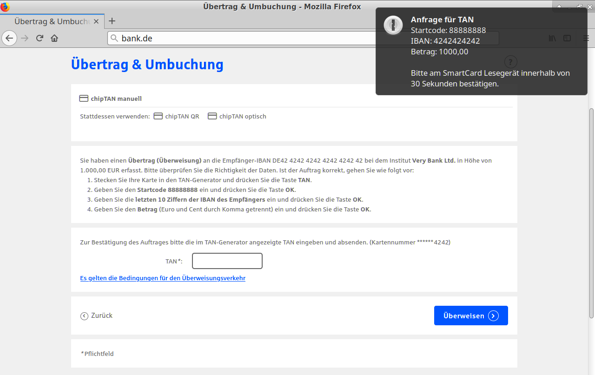
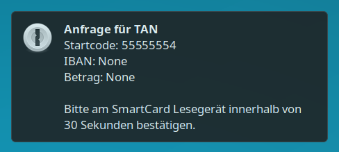

# usbtan-cli

Request chipTAN from USB-cardreaders via libchipcard.

## Usage

Parameters:

    usbtan-cli STARTCODE [IBAN] [AMOUNT]
    
Must use the last 10 digits of the IBAN only.  
Amount must use comma for decimal point.

Example:

    usbtan-cli 42424242 1234567890 3,50

## Extended Usage

1. Copy instructions for obtaining TAN from banking website into clipboard.
2. Invoke `usbtan-viaclipboard`.
3. Acknowledge data on cardreader.
4. Clipboard is now populated with obtained TAN. Paste it into the appropriate field.

### Screenshots

Requesting a TAN for a transfer:  

Requesting a login TAN for two-factor authorization:  

Receive TAN via clipboard:  

Experience an error:  

